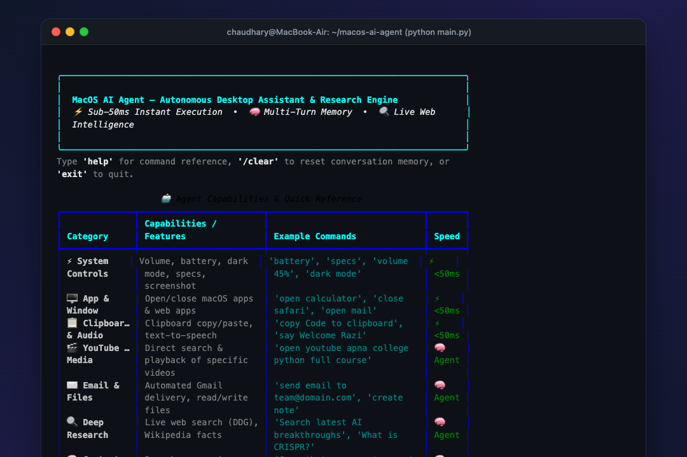

# 🤖 MacOS AI Agent

> **An Autonomous Desktop Assistant & Real-Time Knowledge Retrieval Engine for macOS.**  
> Powered by **LangChain**, **Google Gemini 3.5 Flash**, **Pydantic**, and native **macOS Automation**.

[](https://www.python.org/)
[](https://www.langchain.com/)
[](https://aistudio.google.com/)
[](https://www.apple.com/macos/)
[](LICENSE)

---

## 🌟 Overview

**MacOS AI Agent** is a production-engineered AI assistant designed to bridge high-speed language model reasoning with real-world operating system execution. 

<p align="center">
  
</p>

Unlike traditional chatbots that can only converse, **MacOS AI Agent** is an **Action Agent**: it reasons about user intent, decides the optimal course of action, queries live external tools (Wikipedia, DuckDuckGo web search), and directly automates macOS native applications, media players, system settings, desktop files, and emails.

---

## 🚀 Key Features

### ⚡ 1. Sub-50ms Instant Direct Routing
Deterministic system actions (volume control, battery status, screenshots, dark mode, screen lock, clipboard management, text-to-speech) bypass LLM API latency completely via a localized intent pattern router, executing natively in **under 50 milliseconds**.

### 🧠 2. Multi-Turn Conversational Memory
Maintains rolling context across multiple user requests. You can research a topic, ask follow-up questions, and command the agent: *"Now save that summary into a note file on my Desktop"*, or *"Email that research to my colleague"*.

### 🔍 3. Live Web Research & Structured Synthesis
Gathers up-to-date facts, current news, and scientific articles using DuckDuckGo search and Wikipedia. All research findings are strictly validated against a **Pydantic schema** (`ResearchResponse`) with resilient multi-tier JSON regex fallbacks to eliminate parsing failures.

### 🎬 4. YouTube Video Auto-Search & Playback
Specify any video, tutorial, song, or channel (e.g. *"open youtube apna college channel and in that the video python full course for beginner"*). The agent automatically queries YouTube's endpoint, extracts the precise video ID, and launches `https://www.youtube.com/watch?v=...` directly in your browser.

### ✉️ 5. Automated Email Dispatch
* **Direct SMTP Transmission:** If configured with a Google App Password, transmits emails silently in the background in **0.2 seconds** via encrypted SSL (`smtp.gmail.com:465`).
* **Web Compose Fallback:** Opens the official Gmail Web Compose interface with recipient, subject, and body pre-filled, triggering the send shortcut automatically.

### 🖥️ 6. Native macOS Desktop Control
* Open & close any desktop app (`open_app`, `close_app`).
* Distinguishes native apps from web services (e.g., native **Mail.app** vs. web **Gmail**, native **Notes.app** vs. **Google Keep**).
* Read and write files directly on the macOS Desktop.
* Native Apple Reminders integration (`create_reminder`).
* Media control for Apple Music and Spotify (play, pause, next, previous, now playing).

---

## 🏗️ System Architecture

```
                                  User Command / Query
                                           │
                                           ▼
                           ┌───────────────────────────────┐
                           │   Sub-50ms Direct Router      │
                           │   (Regex & Intent Classifier) │
                           └───────────────┬───────────────┘
                                           │
                  ┌────────────────────────┴────────────────────────┐
                  │ Match                                           │ No Match (Reasoning Required)
                  ▼                                                 ▼
     ┌────────────────────────┐                    ┌─────────────────────────────────┐
     │ Instant Native Tool    │                    │ Google Gemini 3.5 Flash Agent   │
     │ - Audio / Volume       │                    │ (LangChain Tool-Calling Engine) │
     │ - Dark Mode / Battery  │                    └────────────────┬────────────────┘
     │ - Lock / Screenshot    │                                     │
     └────────────┬───────────┘                                     ▼
                  │                                ┌─────────────────────────────────┐
                  │                                │ Autonomous Tool Selection       │
                  │                                │ ├── DuckDuckGo Web Search       │
                  │                                │ ├── Wikipedia API               │
                  │                                │ ├── YouTube Video Finder        │
                  │                                │ ├── Desktop App & File I/O      │
                  │                                │ └── Gmail Automated Dispatch    │
                  │                                └────────────────┬────────────────┘
                  │                                                 │
                  └────────────────────────┬────────────────────────┘
                                           │
                                           ▼
                           ┌───────────────────────────────┐
                           │   Pydantic Schema Validation  │
                           │   & Multi-Stage JSON Parser   │
                           └───────────────┬───────────────┘
                                           │
                                           ▼
                           ┌───────────────────────────────┐
                           │ Rich Styled Terminal UI       │
                           │ + Auto-Log to research_output │
                           └───────────────────────────────┘
```

---

## 🛠️ Tech Stack

| Component | Technology | Purpose |
| :--- | :--- | :--- |
| **Language** | Python 3.10+ | Core application logic |
| **LLM Engine** | Google Gemini 3.5 Flash Lite | High-speed, high-rate-limit autonomous reasoning |
| **Agent Framework** | LangChain Core / Classic | Tool-calling agent orchestration & scratchpad |
| **Data Validation** | Pydantic v2 | Strict schema enforcement and type validation |
| **Terminal UI** | Rich | Vibrant aesthetic formatting, panels, tables & spinners |
| **OS Automation** | macOS `subprocess` & AppleScript | Native hardware, application, and window control |
| **Information APIs** | DuckDuckGo Search, Wikipedia API | Real-time web retrieval |

---

## 📦 Installation & Setup

### 1. Clone the Repository
```bash
git clone https://github.com/Razichoudhary/macos-ai-agent.git
cd macos-ai-agent
```

### 2. Create and Activate Virtual Environment
```bash
python3 -m venv venv
source venv/bin/activate
```

### 3. Install Dependencies
```bash
pip install -r requirements.txt
```

### 4. Configure Environment Variables
Copy `.env.example` to `.env`:
```bash
cp .env.example .env
```
Open `.env` and add your **Google Gemini API Key**:
```env
GEMINI_API_KEY=your_gemini_api_key_here
GEMINI_MODEL=gemini-3.5-flash-lite
```

*(Optional: To enable 100% automated background email sending, add your Gmail address and a 16-character [Google App Password](https://myaccount.google.com/apppasswords)):*
```env
SENDER_EMAIL=your_email@gmail.com
GMAIL_APP_PASSWORD=your_16_character_app_password
```

---

## 🚦 Usage

Launch the interactive terminal interface:
```bash
python main.py
```

### Example Commands:

#### 🔍 Live Research:
* `What is quantum computing in simple terms?`
* `Who won the latest Nobel Prize in Physics?`
* `What is photosynthesis?`

#### 🎬 YouTube Playback:
* `open youtube apna college channel and in that the video python full course for beginner`
* `play lofi hip hop radio on youtube`

#### 🖥️ Desktop & App Control:
* `open calculator` / `close calculator`
* `open safari` / `close safari`
* `open gmail` *(opens Gmail web in browser)* vs `open mail` *(opens native Apple Mail)*
* `open youtube`

#### 📝 Notes & Files:
* `create a note on my Desktop called project_ideas.txt with the text AI Agent is running`
* `read file project_ideas.txt`

#### ⚡ Sub-50ms Quick Controls:
* `battery` *(shows percentage, charging state, and cycle count)*
* `screenshot` *(captures screen to Desktop)*
* `dark mode` *(toggles macOS dark/light appearance)*
* `volume 50%` / `mute` / `unmute`
* `specs` *(displays chip, memory, and disk space)*
* `say Welcome to MacOS AI Agent`

#### ✉️ Email Sending:
* `send an email to friend@example.com with subject Meeting Today saying Hey, let's catch up at 5 PM!`

---

## 🔒 Security & Privacy

* **Zero Hardcoded Secrets:** All credentials (`GEMINI_API_KEY`, email passwords) are stored exclusively in `.env`.
* **Git Safe:** The repository contains a strict `.gitignore` configured to ensure that `.env`, virtual environments, cache files, and private logs can never be accidentally committed to GitHub.
* **Non-Destructive:** File operations are restricted to non-destructive creation and reading; no arbitrary recursive deletion tools are provided.

---

## 📄 License

Distributed under the **MIT License**. See `LICENSE` for details.

---

## 👨‍💻 Author

Built with ❤️ by **Razi Chaudhary**
* 🐙 **GitHub:** [@Razichoudhary](https://github.com/Razichoudhary)
* 💼 **LinkedIn:** [Razi Chaudhary](https://www.linkedin.com/in/razi-chaudhary-ba946b324/)

Contributions, feature suggestions, and pull requests are welcome!

---

## 🤝 Contributing

Contributions make the open-source community an amazing place to learn, inspire, and create. Any contributions you make are **greatly appreciated**. Please check out [CONTRIBUTING.md](CONTRIBUTING.md) for details on our code of conduct and development guidelines.

